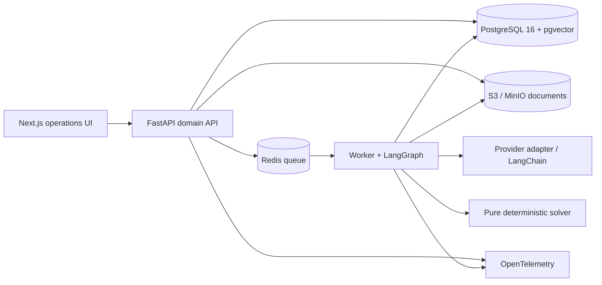
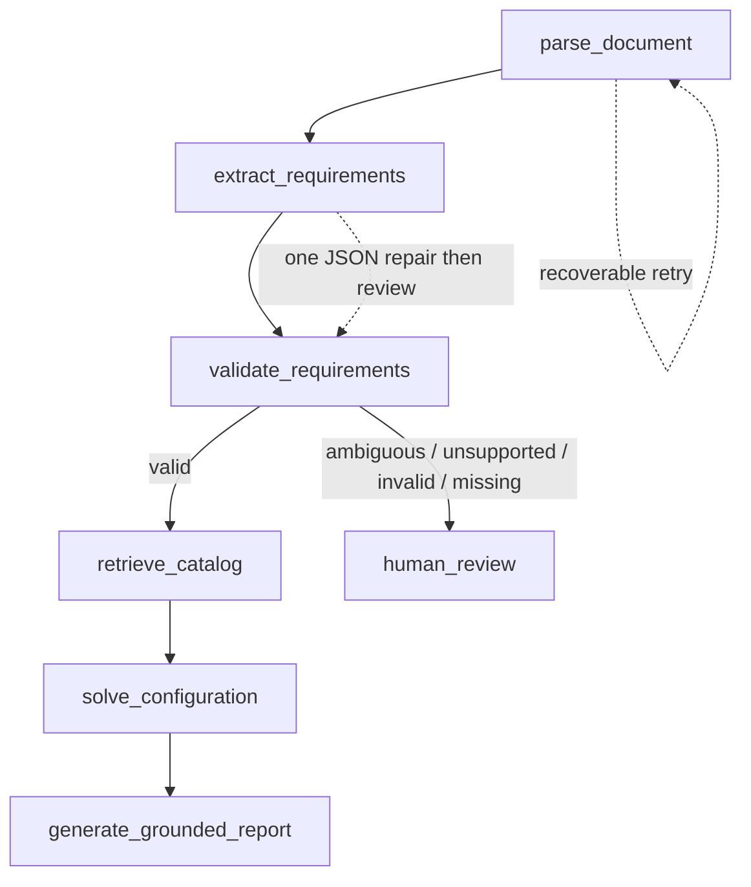

# Architecture

## High-level design



Documents enter object storage once and are represented by immutable document/version/page/span records in PostgreSQL. A queue worker extracts text/OCR, then runs the audited graph. The API serves versioned results, citations, exports, and safe traces. The UI calls only APIs; it never directly accesses storage, credentials, prompts, or providers.

## Workflow and authority boundaries



LangChain is used inside nodes for document loaders, prompts, structured output, embeddings/retrievers, tool wrappers, and provider abstraction. LangGraph is the workflow layer for explicit state, conditional business routing, bounded retries, human-review interruption, and auditable traces. The LLM never determines physical feasibility or final cost: versioned catalog data and deterministic solver rules do.

## Modules and configuration

- `apps/web`: Next.js operations UI and exports.
- `apps/api`: FastAPI routes, Pydantic contracts, SQLAlchemy persistence, Alembic.
- `apps/worker`: queue consumers, parser/OCR adapters, graph runs, exports.
- `packages/contracts`: versioned shared API contracts.
- `packages/solver`: pure constraint, budgeting, cost, risk, ranking engine.
- `packages/catalog`: validation/import/versioning and compatibility rules.
- `packages/evals`: fixtures, answer keys, fakes, evaluator.
- `infra`: Compose, containers, deployment, observability, runbook.

Configuration holds store/queue/database endpoints, model identifiers, processing limits, and telemetry endpoint. Secrets are injected through untracked local `.env` or deployment secret stores only.

## Data flow

1. Upload creates immutable `document`/`document_version`, stores bytes, and queues parse work.
2. Parse emits normalized text blocks with page, span offsets, method, and evidence hash.
3. Extraction writes a requirement set with citations, confidence, and validation status.
4. Retrieval selects versioned catalog records and approved specifications, recording citations.
5. Solver receives validated requirements and catalog snapshot, returning deterministic candidates and rejection reasons.
6. Report generation can phrase only requirement/retrieval/solver evidence.
7. Human approval is a separately audited state transition; it never modifies facts.

Core aggregates: documents, versions, pages, source spans, runs, node runs, requirement sets, catalog versions/items, compatibility rules, solver runs, recommendation versions, approvals, exports, audit events. pgvector indexes approved catalog/specification chunks, not unrestricted raw tender content.

## API surface

- `POST /v1/documents`: upload PDF/DOCX.
- `GET /v1/documents/{id}` and `GET /v1/document-versions/{id}/spans/{span_id}`: status and citation excerpt.
- `POST /v1/recommendations`: start graph run for document/catalog version.
- `GET /v1/runs/{trace_id}`: safe node status, timing, citations, branch, review action.
- `GET /v1/recommendations/{id}`: versioned recommendation.
- Catalog CRUD/import under `/v1/catalog`; `POST /v1/recommendations/{id}/approval`; PDF/CSV export endpoint.

Every response has a correlation/trace ID. Catalog edits, approvals, exports, and raw-document operations have authorization and audit controls.

## Recommendation contract

```json
{
  "outcome": "feasible | feasible_with_changes | not_feasible | needs_review",
  "document_version_id": "uuid",
  "catalog_version_id": "uuid",
  "solver_version": "semver",
  "model_identifier": "provider/model-or-fake",
  "prompt_version": "extract-vN",
  "trace_id": "uuid",
  "requirements": [{"value_si": 0, "unit": "...", "citations": ["span-id"], "confidence": 0}],
  "selected_configuration": {"catalog_item_ids": ["..."], "bom": [], "margins": {}},
  "cost_paise": {"bom": 0, "engineering_integration": 0, "contingency": 0, "total": 0},
  "lead_time_days": 0,
  "alternatives": [], "rejected_near_misses": [], "risks": [], "assumptions": [],
  "clarification_questions": [],
  "human_approval": {"state": "pending | approved | rejected | changes_requested"}
}
```

## Deployment

Local Compose runs web, API, worker, Postgres/pgvector, Redis, and MinIO. Production uses HTTPS ingress, container images, managed PostgreSQL backups, managed Redis, encrypted S3-compatible storage, least-privilege identities, deployment secret manager, autoscaled workers, controlled migrations, and redacted OpenTelemetry telemetry. No provider key reaches a browser.
