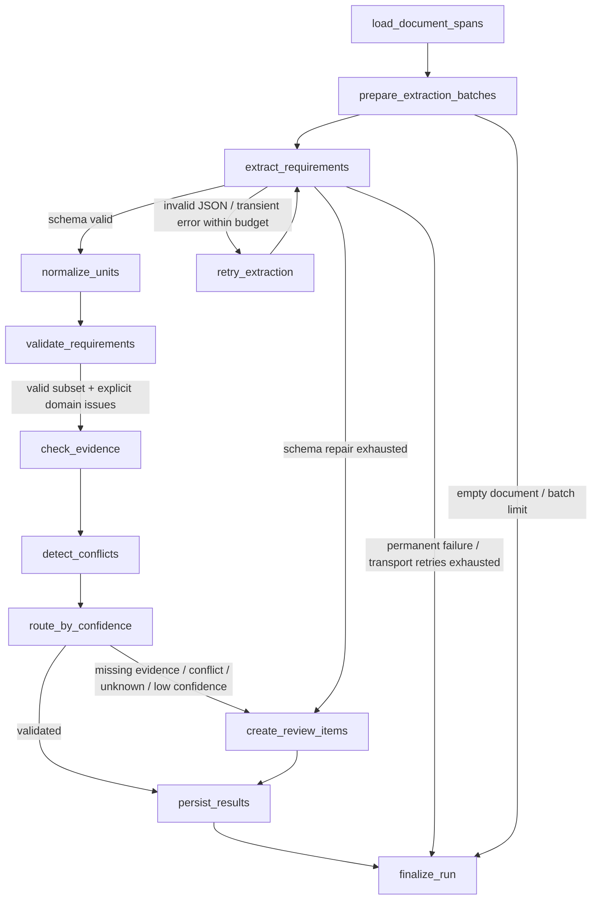

# C03: evidence-backed requirement extraction

The API consumes a completed C02 document version, dispatches an RQ job, and exposes
the run under `/v1/extraction-runs/{trace_id}`. It returns extraction facts only.
`completed` means extraction validation passed; it does not mean engineering
feasibility, procurement acceptance, or commercial approval.

## LangChain inside nodes

`langchain-core` supplies `ChatPromptTemplate`, `PydanticOutputParser`, `RunnableLambda`
and `StrOutputParser`. `ModelAdapter` composes these primitives; `langchain-openai`
provides the opt-in `ChatOpenAI` adapter, bound to `response_format=json_schema`
with `strict=true`. The pinned live model is `gpt-4.1-mini-2025-04-14`.
Other providers can implement the same
adapter contract without changing the graph. Every response first passes strict
Pydantic JSON validation, so partial-JSON repair or coercion by a forgiving parser
cannot silently approve a response. The model produces original values only;
normalization and evidence anchors are generated deterministically.

The prompt is `apps/api/app/extraction/prompts/extract-v2.txt`, separate from graph
code. A repair receives only its failing batch, the previous invalid response
(explicitly labeled untrusted data), compact field paths/expected types, and the
complete expected schema. These inputs remain in process memory, never trace/logs.
Successful batches are cached through retries. `EXTRACTION_MAX_REPAIRS` is zero or one;
there is at most one schema repair per run. Unsupported units are review issues,
not a reason to ask a model to invent replacements. Provider timeout/429/5xx
retries have a separate configurable budget (default one, maximum three), and
vendor SDK retries are disabled. Authentication/configuration failures fail immediately.
Sources: [LangGraph graph API](https://docs.langchain.com/oss/python/langgraph/graph-api)
and [LangChain ChatOpenAI integration](https://docs.langchain.com/oss/python/integrations/chat/openai).

## LangGraph workflow



The implementation is a compiled `StateGraph`, not a diagram standing in for a
linear chain. State carries run/document anchors, batches, candidates, normalized
values, accepted evidence, findings, repair/transport counts, selected branch and
final outcome. A linear chain cannot express the bounded repair cycle, conditional
review route and distinct terminal failure branch clearly. Any unexpected node
failure also routes to finalization with a safe error code.

Reproduce the actual graph (from `apps/api`):

```powershell
uv run python -m app.extraction.workflow
```

Each node writes a running audit record before work, then a terminal status,
timestamps, elapsed milliseconds, attempt number, selected branch and safe counts/
issue codes. The status API never returns prompts, raw completions or source text.
LangSmith tracing is explicitly disabled during execution even if the parent
environment enables it. Evidence quotes are available only in requirement results
and source excerpts, not the trace summary.

## Contracts and deterministic controls

Schema `requirements-v2`, prompt `extract-v2`, normalizer `si-v1`, and review policy
`review-v2` are versioned. Historical v1 records remain readable and are never
rewritten. No additional migration is needed: typed payloads use existing JSON columns.
The categories include mission/procurement, platform,
range/endurance/payload/MTOW/altitude/speed, propulsion/battery, environment/wind/
temperature/ingress, sensors/communications/navigation/integration, compliance/
testing, quantity/delivery/warranty and commercial constraints.

Example accepted range requirement (IDs abbreviated for illustration):

```json
{
  "category": "range", "attribute": "range", "semantics": "mandatory",
  "operator": "minimum", "original_value": 25.0, "original_unit": "km",
  "raw_value": {"kind": "scalar", "value": 25.0}, "raw_unit": "km",
  "confidence": 0.95,
  "evidence": [{"span_id": "span-uuid", "quote": "Range >= 25 km."}],
  "normalized_value": 25000.0, "normalized_unit": "m",
  "normalization_version": "si-v1",
  "validated_evidence": [{
    "document_id": "document-uuid", "document_version_id": "version-uuid",
    "span_id": "span-uuid", "page_number": 1, "section_name": null,
    "chunk_index": 0, "quote": "Range >= 25 km.", "quote_start": 0, "quote_end": 15
  }]
}
```

Unknown original values remain the explicit string `unknown` with normalized unit
`unknown` and require review. The strict provider schema couples numeric operators
to scalar/unknown shapes, range to lower/upper bounds, text/enum to a scalar source
phrase, and boolean to a boolean value. Unknown is `{ "kind": "unknown", "value": null }`.
All wire keys are required; `original_unit` is nullable. Omitted required keys need
repair; they are not silently filled. Every nested object forbids extra properties.
Qualitative lists/alternatives remain a contiguous text phrase, not numeric arrays.
Dates and qualitative equality use text, never numeric `exact`.

Numeric/range operators reject booleans, ambiguous strings, nonfinite numbers and
reversed bounds. Unambiguous decimal literals such as `"25"` or `"25.5"` are converted
only by deterministic normalization; the original string remains in `raw_value`
and `original_value`. Units, comma-grouped numbers, inequalities and alternatives
are not coerced. Unsupported or mismatched values create explicit review issues;
valid cited requirements may persist alongside them, never as an approved full result.
Supported units are an explicit allowlist;
unsupported or dimensionally wrong units are never guessed. SI units are m, kg,
s, m/s, K, J, C, V and W; counts are dimensionless and INR converts to integer
paise. Numeric commercial values in other currencies require review. Negative
normalized physical values and fractional counts/paise fail validation.

Citations must point to this exact document version, with an exact substring
quote. Server-resolved page/section/chunk and quote offsets cannot be supplied by
the model. Quote offsets are Unicode character offsets within `SourceSpan.text`,
end-exclusive. Numeric values and original units must occur in cited evidence;
text/enum values must occur in a quote. These checks establish source grounding,
not complete semantic entailment: obligation, negation, and contextual interpretation
still need human validation. Conflicts are conservative interval/categorical checks
for identical category+attribute keys, primarily mandatory constraints; differently
named attributes and context-sensitive exceptions require review by a human.

Equivalent constraints produce nonblocking duplicate findings, with both source
links retained. Contradictions, ambiguous/unknown values, confidence below the
configured threshold, or missing platform/range/endurance/payload information cause
`needs_review`. Missing critical categories produce questions/issues, never invented
requirements. Only schema-valid, normalized, citation-valid requirements enter the
requirements table. Invalid candidates become safe issue codes. Requirement APIs
may contain a validated subset of a `needs_review` run; consumers must check run state.

## Storage, API and review

Migration `0002_extraction` adds `extraction_runs`, `extracted_requirements`,
`requirement_evidence`, `extraction_issues` and `extraction_node_runs`. Idempotency
uses a unique SHA-256 of document version, schema/prompt versions and the safe model/
validation configuration (provider, model, temperature, token/time limits, budgets,
batch settings and policy/normalizer versions). Keys/secrets are excluded. Atomic
worker claims prevent replayed queue jobs duplicating results; concurrent API
requests converge on the unique run. A queue-dispatch failure can be retried with
the same start request. Workers refuse configuration drift from the stored snapshot.

```text
POST /v1/document-versions/{version_id}/extractions
GET  /v1/extraction-runs/{trace_id}
GET  /v1/extraction-runs/{trace_id}/requirements
GET  /v1/extraction-runs/{trace_id}/issues
POST /v1/extraction-runs/{trace_id}/issues/{issue_id}/decision
```

Start returns 202; an identical rerun returns 200 and the existing trace ID. Ingestion
must be completed or the API returns 409. `/docs` provides OpenAPI contracts.
The review decision body is `{ "decision": "acknowledge", "reviewer": "name",
"note": "Ask the buyer to clarify." }`; `request_reextraction` is the other choice.
Decisions are immutable and idempotent. Recording a decision does not waive a
validation error, rewrite facts, approve engineering, or automatically rerun work.
For an actual new extraction, use a corrected document version or deliberately
version the prompt/model configuration. Reviewer identities are self-declared in
this local demo; authentication is outside C03.

## Local verification

Defaults use `LLM_PROVIDER=fake`, `LLM_MODEL=fixture-v1`. The default fake returns
an empty requirement set and missing-field review items; it proves queue/graph/
persistence plumbing only. Tests use scripted LangChain adapters for populated
outputs, deliberately malformed responses and provider errors. Fixtures are locally
authored synthetic unit/integration inputs, not part of the six-tender evaluation
corpus and not held-out tenders.

```powershell
docker compose up --build -d
docker compose exec -T api alembic current
$upload = curl.exe -s -F "file=@apps/api/tests/fixtures/messy-tender.txt;type=text/plain" http://localhost:8000/v1/documents | ConvertFrom-Json
do {
  Start-Sleep -Seconds 1
  $document = Invoke-RestMethod "http://localhost:8000/v1/documents/$($upload.document_id)"
} while ($document.state -in @('uploaded', 'processing'))
if ($document.state -ne 'completed') { throw 'Ingestion failed; inspect document status.' }
$run = Invoke-RestMethod -Method Post "http://localhost:8000/v1/document-versions/$($document.document_version_id)/extractions"
Invoke-RestMethod "http://localhost:8000/v1/extraction-runs/$($run.trace_id)"
Invoke-RestMethod "http://localhost:8000/v1/extraction-runs/$($run.trace_id)/requirements"
Invoke-RestMethod "http://localhost:8000/v1/extraction-runs/$($run.trace_id)/issues"
```

For an authorized live smoke test, set `LLM_PROVIDER=openai`, `LLM_MODEL` to an
approved chat model that supports the configured temperature/token limit, and
`LLM_API_KEY` locally in the untracked root `.env`. Then run the exact commands:

```powershell
docker compose up -d --force-recreate api worker
# Repeat the upload/start/status commands above; poll until completed/needs_review/failed.
```

Do not put a key on a command line or paste it into a report. This action sends the
selected document's source text to the configured provider. Use only authorized
fixtures. A live smoke is not an accuracy evaluation. No embeddings, retrieval,
catalog, solver, BOM or costing is implemented in C03.

Checks from `apps/api`: `uv run ruff check .`, `uv run ruff format --check .`,
`uv run pytest -p no:cacheprovider`. Web checks remain `npm run format`, `npm run lint`,
`npm run typecheck`, and `npm test` from `apps/web`. Compose: `docker compose config
--quiet`, `docker compose exec -T api alembic upgrade head`, `docker compose ps`.

Run the populated fake-model integration smoke against PostgreSQL/MinIO (root PowerShell):

```powershell
Get-Content apps/api/tests/compose_extraction_smoke.py -Raw | docker compose exec -T api python -
```

This uploads a labeled synthetic fixture through the API, waits for RQ ingestion,
then runs a scripted model adapter against PostgreSQL with its own model snapshot.
It verifies four normalized, cited requirements through HTTP and evidence-table
links. It is repeatable by identity and leaves synthetic demo records in local storage.

## Remaining boundaries

Graph execution state is in memory; PostgreSQL stores durable audit, outputs and
human-review items. This is not yet checkpoint-resumable after process termination.
A killed worker may leave `processing`/`running` records for operator investigation;
automatic recovery/DLQ is C08. Review is a persisted terminal workflow route, not
LangGraph `interrupt`/`resume` in C03. Long spans are divided on character boundaries,
so a split clause may need review. Effective batch characters are bounded by the
smaller of `EXTRACTION_BATCH_CHARS` and `LLM_MAX_TOKENS` to leave output headroom;
this heuristic does not guarantee sufficient output tokens for every dense clause.
Truncated/invalid JSON is never accepted. Batch limits fail explicitly instead of silently
truncating documents. Structured JSON does not establish extraction recall or
confidence calibration; the governed evaluation corpus and human answer keys are
still needed. No raw candidate completions are retained for debugging.

## Schema compatibility regression

The v1 live failure was reproduced with numeric `exact` receiving a string
and `enum` receiving lists of strings. Plain chat output was only prompted with JSON,
while operator/value coupling existed only in Python validators and repair received
one generic code. v2 enforces operator-specific shapes at the provider boundary,
retains strict local Pydantic validation, and records safe error paths/batch IDs.
The original failed runs remain immutable; an operator-authorized linked run records
its parent ID and audit fingerprint. A new schema/prompt identity is used, so repeated
public start requests converge without calling the provider again.

Compatibility reference: [OpenAI structured output requirements](https://developers.openai.com/api/docs/guides/structured-outputs).
