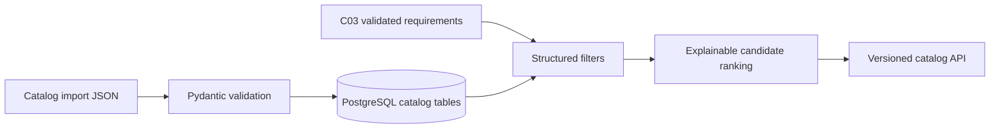

# C04 — versioned drone capability catalog

C04 adds a versioned, provenance-carrying catalog for synthetic demonstration data. It is a candidate retrieval service, not an engineering feasibility solver. C05 owns deterministic configuration solving, BOM calculation, and feasibility decisions.

## Architecture



`catalog_versions` anchors immutable snapshots. `catalog_items` stores stable fields and constrained category `specs`; weights are canonical SI kilograms internally (the API accepts/returns integer grams at the boundary) and prices are integer paise. `catalog_prices` preserves effective-dated price history. `catalog_suppliers` stores supplier provenance, while `catalog_compatibility_rules` stores explicit compatible/incompatible references. No private tender content is imported.

The synthetic seed contains three airframe classes, batteries, cameras, communication, motor/ESC combinations, one unavailable item, one deprecated item and a deliberately incompatible ESC. Records are explicitly labelled `synthetic-demo`.

## APIs

* `POST /v1/catalog/versions` creates an immutable snapshot identity.
* `GET /v1/catalog/versions/current` returns the current snapshot.
* `POST /v1/catalog/import` imports an idempotent batch and compatibility rules.
* `POST /v1/catalog/items` creates a new item/version without deleting history.
* `GET /v1/catalog/items` supports version, category, manufacturer, availability, price, weight, offset and limit filters.
* `GET /v1/catalog/items/{id}` returns specifications and provenance.
* `GET /v1/catalog/compatibility-rules` lists explicit rules.
* `GET /v1/catalog/suppliers` and `GET /v1/catalog/prices` inspect provenance, inventory and historical prices.
* `POST /v1/catalog/items/{id}/deactivate` creates a new inactive item version; the prior row is never mutated.
* `POST /v1/catalog/retrieve` ranks candidates with structured requirements.
* `POST /v1/catalog/retrieve-from-run/{run_id}` consumes only persisted C03 `requirements-v2` records and carries review state/evidence span IDs forward.

Retrieval score is `final_score = structured_match_score`; the semantic score is currently `0.0` because embeddings are deliberately deferred to the later retrieval commit. Mandatory failures always make a candidate ineligible. Preferred matches affect the score but do not assert feasibility. Results include one breakdown entry per requirement, including requirement ID/evidence span, missing or failed attributes, availability status, and overspec weight/cost penalty metadata. A run with C03 `needs_review` is carried forward as `review_required`; candidate retrieval never upgrades that state.

## Validation and limitations

Pydantic rejects unknown categories, currencies, negative values, malformed ranges and invalid lifecycle/availability values. The import validator rejects unsupported units and inventory contradictions. Foreign keys and unique `(sku, item_version)` constraints reject dangling compatibility references and accidental overwrites. Ambiguous values are rejected rather than coerced. Supplier, price and compatibility write APIs are intentionally small in this demo; C05 consumes the stable retrieval contract.

## Local verification

```powershell
docker compose exec -T api alembic upgrade head
$seed = Get-Content apps/api/tests/fixtures/catalog_seed.json -Raw
Invoke-RestMethod -Method Post -Uri http://localhost:8000/v1/catalog/import -ContentType 'application/json' -Body $seed
Invoke-RestMethod http://localhost:8000/v1/catalog/versions/current
Invoke-RestMethod 'http://localhost:8000/v1/catalog/items?category=camera'
```

The fixture is safe synthetic data and does not contain the private tender or live-gate reports. C04 does not use paid providers, embeddings, pgvector queries, or any LLM.
