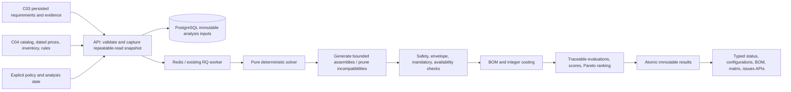
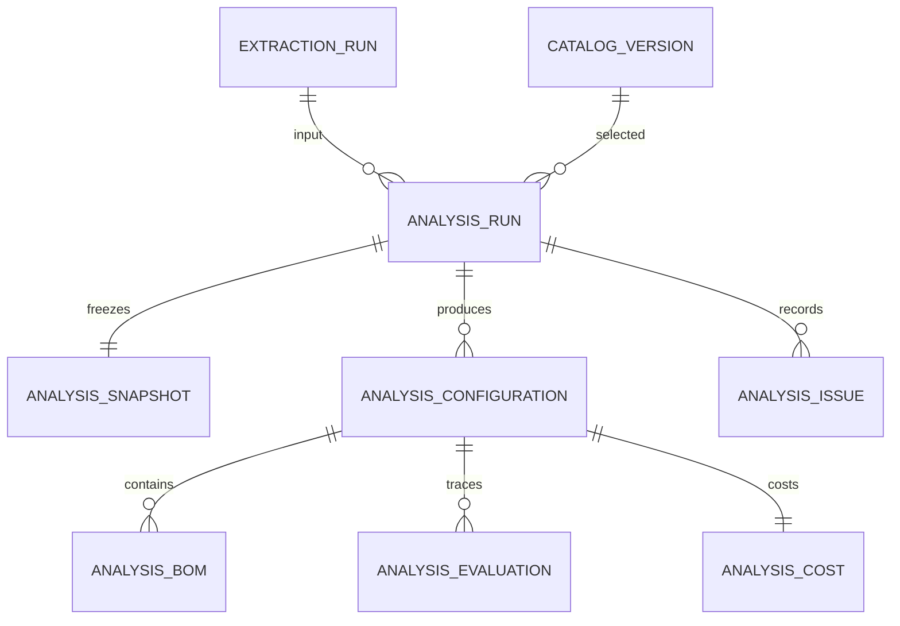

# C05 deterministic solver and costing

## Scope and authority

C05 implements catalog-bounded decision support, not flight certification, procurement approval, or an aerodynamic simulator. No LLM, embedding, semantic retrieval, or provider call participates in analysis. C03 supplies citation-valid requirements; C04 supplies versioned catalog data. Unsupported clauses remain unknown and block approval when mandatory or ambiguous.

The delivery plan remains authoritative: the commit is `feat: solve feasible drone configurations and cost`. The plan's recommendation `outcome` is retained alongside the requested analysis `status`. Changes from a declared baseline produce `feasible_with_changes`; conditional assumptions are a separate concept, not automatically a modified BOM.

## Architecture and modules



The pure domain is `apps/api/app/solver`, with no FastAPI, ORM, network or provider calls. It uses Pydantic input/output contracts and shares existing JSON-date and C03 requirement contracts. Keeping it in the existing installable API package avoids an unconfigured parallel package.

- `contracts.py`: versioned snapshot, policy, assembly, result contracts.
- `orchestration.py`: deterministic identity, ordered evaluation and status policy.
- `classification.py`: explicit category/attribute/unit mapping and satisfaction records.
- `compatibility.py`: electrical, interface and explicit catalog pair rules.
- `generation.py`: bounded, sorted assembly enumeration and early pruning.
- `envelope.py`: mass/payload, declared performance and battery-energy validation.
- `constraints.py`: lifecycle, supplier, inventory and lead-time checks.
- `bom.py`: exact component quantities and effective-price selection.
- `costing.py`, `numbers.py`: checked integer arithmetic and separated cost policy.
- `scoring.py`, `ranking.py`: soft objectives, tradeoffs, deterministic order/Pareto.
- `explanations.py`: structured reason codes, safe explanations and clarification questions.
- `app/analysis`: typed HTTP contracts, snapshot capture, queue dispatch and atomic persistence.

## Solver choice and constraint hierarchy

Bounded deterministic enumeration is sufficient for the small explicitly declared assembly option sets in this demo. It is easier to audit than introducing an optimization library and its encoding. This is not unrestricted Cartesian search over unrelated catalog parts.

Each template declares unique slots, allowed SKU/item-version references, quantities, baseline options and provenance. Required multirotor flight-critical slots are motor, ESC, propeller, battery, flight controller, navigation and communication. Motor/ESC/propeller counts equal rotor count. This release supports one battery bus and one flight controller; unsupported architectures require review rather than inferred assemblies.

Order of authority:

1. Physical and safety constraints: mass/payload, voltage, current, power, interfaces and explicit incompatibility.
2. Mandatory tender constraints supported by explicit mappings.
3. Availability, active lifecycle, supplier and fleet inventory.
4. Preferences.
5. Weighted objectives.

Cheap, light or high-scoring parts cannot override a hard rejection or review blocker. Explicit incompatible pairs prune partial assemblies. Missing compatibility data blocks final recommendation, rather than being assumed compatible. Constrained compatibility rules without an implemented predicate remain review issues.

## Engineering envelopes and units

Internal arithmetic uses integer grams, metres, seconds, millimetres/second, milli-kelvin, joules, watts, paise and basis points. Decimal conversion from catalog SI values must be exact at the declared scale; unrepresentable precision fails safely. No floating-point equality makes a constraint decision.

Gross mass includes all selected parts plus external demanded payload not already represented by selected cameras/payloads. Rated MTOW is evaluated separately from actual assembled mass. Physical gross mass must fit derated MTOW; carried payload must fit payload capacity.

Performance requires a catalog envelope explicitly declared applicable to every assembly option and bounded by maximum mass/payload. There is no range inference from semantic similarity or an arbitrary battery-size ratio.

- Usable energy: floor(voltage V × capacity C), then reserve derating; V × C = J.
- Energy duration: floor(usable J / declared average W).
- Endurance: minimum of energy duration and derated catalog endurance.
- Range: derated declared range only when mass/load conditions and energy duration cover the declared derated endurance; otherwise unverified.
- Battery discharge current must cover motor-count × motor current; voltage must fit motor/ESC limits; average declared power must fit battery voltage × discharge current.

Default margins: range/endurance 10%, MTOW 5%, battery reserve 20%. These are configurable reviewable assumptions, not certified safety factors. Full thrust curves, propeller dynamics, thermal/transient response, redundancy, radio legality and actual flight qualification remain outside C05. Declared compliance/testing attributes are evidence from catalog provenance, not independent certification verification.

Supported explicit mappings cover platform, payload, rated MTOW, range, endurance, altitude, speed, communication range, navigation, sensor, wind, temperature interval, IP rating, compliance/testing enums, quantity, delivery, warranty and budget. Unmapped attributes, free-text mandates, unsupported units or missing capabilities produce unknown evaluations. Propulsion/battery clauses beyond explicit physical checks require reviewed mappings in a later revision.

## Status policy

- `feasible`: at least one configuration has all supported mandatory checks passing, critical information present, valid costs and no blocking review issue.
- `conditionally_feasible`: those checks pass but operator-supplied nonblocking assumptions remain explicit.
- `infeasible`: verified hard failures eliminate every otherwise assessable configuration.
- `needs_review`: unresolved extraction, missing platform/payload/range/endurance, unsupported mandatory clause, invalid envelope, missing/ambiguous/foreign-currency prices, or another blocking unknown.

Global unresolved inputs prevent an overall infeasible/feasible conclusion when review is still needed. Individual candidates retain their verified hard failures even when the overall analysis needs review. A C03 `needs_review` run never becomes approved; its candidates are provisional and receive no recommended/tradeoff labels. Recording a C03 review decision alone does not clear its unresolved state.

Legacy `outcome`: hard failure → `not_feasible`; unresolved → `needs_review`; valid baseline → `feasible`; valid changed assembly → `feasible_with_changes`.

## Ranking and explanations

Rank proven candidates first, provisional candidates second and rejected candidates last. Within each group:

`score = sum(weight[j] × floor(metric[j] × 10000 / max(1, group_max[j])))`

Lower is better. Metrics are total paise, gross grams, lead days, inventory risk, uncovered-requirement basis points and overspec ratio. Inventory risk is the maximum floor(required fleet quantity × 10000 / stock) across BOM lines. Overspec sums positive excess/target ratios for exceeded numeric minimum requirements in consistent units, capped at 100000 basis points per requirement. Cost/weight penalties remain visible independently of this ratio.

Default weights: cost 4, weight 2, overspec 1, lead time 1, inventory risk 1, uncovered requirements 3. All weights are configurable bounded integers. Valid candidates get Pareto flags using the six raw metrics. Tie-break is sorted SKU, item version, quantity and immutable item ID.

Labels identify lowest-cost, lowest-weight, fastest-available and balanced options only within valid candidates. Balanced is the only recommended label. All bounded results persist; the listing defaults to top-K, and pagination/detail APIs expose the rest. Option IDs outside the first page still resolve to detail endpoints.

Every requirement evaluation preserves extraction/requirement IDs, original and normalized values, semantics, citations/spans, actual capability with item IDs, unit, margin, result and deterministic reason. Explanations are formatted from these facts, never generated by an LLM. Early-pruned combinations have explicit selected-item prefixes and rejection reasons, not fabricated full BOMs.

## BOM and cost policy

Select exactly one price effective on the explicit analysis date (inclusive endpoints). Missing, expired or overlapping effective records block approval. Do not fall back to an item's undated headline cost. Preserve source currency and price ID; only INR aggregates are supported. Foreign currencies remain visible with unknown aggregate cost and a review issue; no implicit FX conversion occurs.

For fleet quantity N:

- BOM quantity = per-drone quantity × N; subtotal = effective unit paise × quantity.
- Material = sum of subtotals.
- Base = material + fixed engineering/integration + per-drone labour × N.
- Overhead and contingency are independently ceiling(base × bps / 10000).
- Tax and margin are independently ceiling((base + overhead + contingency) × bps / 10000).
- Total is their sum, with every term exposed.

`cost-v1` defines markup rather than a target gross-margin percentage. Defaults are zero labour/engineering/overhead/tax/margin and 10% contingency; these are explicit demo estimates, not supplier quotes. Signed 64-bit limits and nonnegative validation protect stored arithmetic; Python intermediate integers do not wrap. Unknown subtotal makes aggregate costs unknown.

## Database and immutability

Migration `0005_solver` follows `0004_catalog_weight_si` without changing C03/C04 tables or audit history.



Physical tables: `analysis_runs`, `analysis_snapshots`, `analysis_configurations`, `analysis_bom`, `analysis_evaluations`, `analysis_costs`, `analysis_issues`. Foreign keys reference extraction runs, catalog items/prices and requirements. Identity, configuration rank and component/requirement combinations have uniqueness constraints and query indexes.

C04 catalog membership and commercial fields can still evolve. C05 therefore captures the entire selected catalog contents, prices, supplier state, rules, requirements/evidence, source versions and policy in a PostgreSQL repeatable-read transaction. The frozen content, not merely the catalog's human label, defines the immutable analysis input.

Identity = SHA-256 of canonical JSON snapshot, including `solver-v1.0.0`, extraction schema/prompt/model versions, date and complete policy. Repeating identical input returns the same analysis; changed source content, snapshot, solver or policy creates another identity. Unique constraints resolve concurrent creation races.

PostgreSQL triggers prevent snapshot mutation and terminal-result insert/update/delete. All result rows and completion state commit atomically. Repeated worker claims cannot execute a terminal run. A failed analysis remains history; change the corrected input/policy or solver version to create another run, never erase a failure.

Replay must use the recorded solver version. Keep the corresponding code commit/image for historical replay after upgrades. Configuration IDs are deterministic hashes of frozen input identity and selection; no live catalog lookup is used while solving.

## Typed APIs

All endpoints are in Swagger at `http://localhost:8000/docs`.

```text
POST /v1/analyses
GET  /v1/analyses/{analysis_id}
GET  /v1/analyses/{analysis_id}/configurations?offset=0&limit=5
GET  /v1/analyses/{analysis_id}/configurations/{configuration_id}
GET  /v1/analyses/{analysis_id}/configurations/{configuration_id}/bom
GET  /v1/analyses/{analysis_id}/configurations/{configuration_id}/requirements
GET  /v1/analyses/{analysis_id}/issues
```

Example POST body (replace IDs with existing records, never tender-specific constants):

```json
{
  "extraction_run_id": "00000000-0000-0000-0000-000000000001",
  "catalog_version_id": "00000000-0000-0000-0000-000000000002",
  "analysis_date": "2026-09-25",
  "policy": {
    "fleet_quantity": 1,
    "top_k": 5,
    "weights": {"cost": 4, "weight": 2},
    "cost": {"labour_paise_per_drone": 10000, "contingency_bps": 1000}
  }
}
```

POST returns 202 for newly queued work or 200 with `idempotent: true` for existing input. Poll state `queued → running → completed|failed`; engineering status is separate from processing state. UUID/date strings are explicitly accepted at JSON boundaries; unrelated types remain strict. Malformed input gives field-level 422; invalid source/evidence/schema gives structured 409; unknown IDs give 404. Queue dispatch failure gives safe 503; repeat the same POST to dispatch the existing queued record.

Authenticated production access control remains planned work; local APIs must not be exposed to untrusted networks. Requirement APIs intentionally contain bounded evidence for authorized reviewers; operational logs contain only IDs, status, counts and safe error codes.

## Configuration, bounds and deployment

No new secret or paid-model setting is needed. Existing DATABASE_URL, REDIS_URL and worker/Compose configuration are reused. Policies are explicit request data frozen in history, not mutable environment defaults.

Default limits: 500 catalog items, 500 requirements, 2000 visited partial combinations, 50000 complete requirement evaluations, top-K 5. Absolute request maxima: 2000 items, 1000 requirements, 10000 visited combinations, 100000 evaluations, top-K 50. Assemblies allow up to 12 slots and 30 options per slot; all limits fail clearly rather than silently truncating search or claiming exhaustive infeasibility. Pareto comparison is quadratic in valid complete configurations, bounded by generation limits. Large catalogs need a later optimization strategy/partitioning.

Existing Redis RQ worker executes analyses with a 300-second job timeout; API request only captures/queues inputs. No new service or infrastructure dependency. Rebuild API/worker and upgrade Alembic. Abrupt worker termination/timeout can leave a run marked running; automated stuck-job recovery is not supplied by C05 and must not overwrite terminal history. Operational recovery belongs in C08. Normal solver failures roll back partial results and persist safe terminal codes.

## Verification and reproducible smoke

Synthetic data only: `tests/fixtures/solver_catalog.json` supplies explicit platform assembly/envelope provenance, cheaper incompatible ESC, valid/oversized ESCs, heavy/light/unavailable batteries and associated components. It makes no real-manufacturer claims.

From repository root:

```powershell
cd apps/api
uv run ruff format --check .
uv run ruff check .
uv run pytest
cd ../web
npm run format
npm run lint
npm run typecheck
npm test
cd ../..
docker compose config --quiet
docker compose up --build -d
docker compose exec -T api alembic current
docker compose ps
docker compose cp apps/api/tests/compose_solver_smoke.py api:/tmp/c05_smoke.py
docker compose cp apps/api/tests/fixtures/solver_catalog.json api:/tmp/c05_seed.json
docker compose exec -T api python /tmp/c05_smoke.py --seed /tmp/c05_seed.json
docker compose cp apps/api/tests/compose_solver_migration.py api:/tmp/c05_migration.py
docker compose exec -T api python /tmp/c05_migration.py
```

The smoke uploads synthetic text through C02, runs a fake C03 extraction (no paid provider), imports the fixture through C04 and runs real queued C05 analyses. Four concurrent HTTP starts must share an ID with one worker attempt. It verifies cheap invalid rejection, cheapest valid selection, weight/cost tradeoffs, unavailable exclusion, impossible/unknown status, all BOM/citation links, changed-policy/catalog identity and byte-equivalent domain replay. A terminal SQL mutation must be blocked.

The migration helper creates a uniquely named isolated empty PostgreSQL test database, migrates C01–C05, verifies all seven protection triggers, and drops only that isolated database afterward. It never resets project data. Existing-database upgrade is checked separately.

Domain/API tests cover safety, review propagation, date/type contracts, integer arithmetic/overflow, effective prices, ranking, limits, deterministic replay, queue recovery, atomic failure and typed OpenAPI. CI uses SQLite for application tests; PostgreSQL-specific concurrency/triggers/migration behavior is covered by the Compose smoke. Frontend currently has zero test cases; its existing format/lint/type checks still run. No customer UI is added in C05.

Host checks: web `http://localhost:3000`; API `http://localhost:8000/health`; Swagger `http://localhost:8000/docs`; MinIO health `http://localhost:9000/minio/health/live` (empty HTTP 200 is correct); console `http://localhost:9001`.

## C06 handoff and limitations

### C05 release evidence (local, 25 September 2026)

- Ruff format/lint and complete backend suite: 114 passed (40 new C05 cases).
- Frontend format, lint and typecheck passed; test command exited successfully with zero tests.
- Existing database upgraded to `0005_solver`; fresh PostgreSQL migration passed with seven history-protection triggers.
- Final synthetic smoke: four concurrent requests, one identity/worker attempt, four valid configurations, identical persisted replay.
- Cheapest material 1,878,000 paise; total with contingency 2,065,800 paise; mass 6,400 g. Oversized alternative adds 240 g and 88,000 paise.
- Cheap incompatible ESC rejected; unavailable battery excluded from immediately buildable options; impossible input infeasible; incomplete input needs review.
- Changed catalog/policy each produces a new identity; every BOM/evaluation has immutable input links; terminal update blocked.
- Existing 47-requirement live C03 input remained needs review with no recommendation, all evidence preserved and unchanged C03 audit-history digest. No provider call.
- Windows-host web, API health, Swagger, OpenAPI, MinIO health and console returned HTTP 200. Rendered Swagger executed a successful final-version analysis lookup.
- All six Compose services running. The isolated migration-test database was removed after verification; existing project data was preserved.

C06 can call the pure solver or analysis service and render grounded facts, rejected near-misses, citations and clarification questions. Retrieval/LLM reporting cannot change hard constraints, prices or solver conclusions. No embeddings, semantic retrieval, full product graph orchestration or customer UI were brought forward.

Real engineering sign-off still needs verified supplier data, tested envelopes, complete requirements and resolved review issues. Synthetic fixture success is not proof a drone can fly. The existing live C03 run's missing/ambiguous requirements must remain provisional. Baseline changes describe allowed assembly options, not automatically authorized engineering substitutions.
