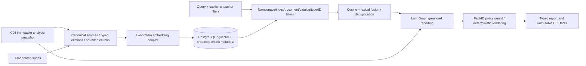
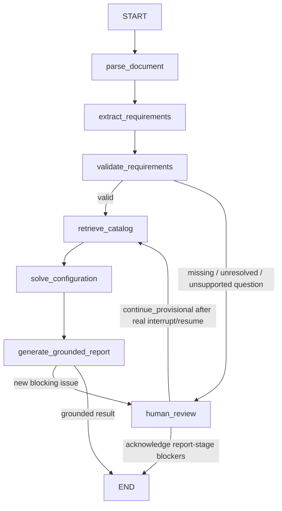
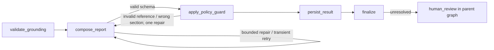

# C06 RAG retrieval and orchestration

## Scope and authority

C06 adds snapshot-isolated indexing, pgvector hybrid search, grounded reporting and a real LangGraph with durable human interruption. C05 alone decides feasibility, compatibility, quantities, configuration selection and costs. The report exposes C05 facts unchanged; neither similarity nor a language model can approve a configuration.

Exact delivery-plan commit: `feat: orchestrate cited recommendations and retrieval`. The plan's six application node names are preserved. Detailed requested operations live inside them and in the reporting subgraph. C06 consumes an existing C05 analysis identity (queued or completed), which already binds the C03 extraction and C04 snapshot; it does not rerun OCR or extraction with a different provider.

## Architecture and responsibilities



Modules under `apps/api/app/rag`:

- `contracts.py`: strict versioned indexing, search, graph, citation and report contracts.
- `providers.py`: LangChain Embeddings, deterministic local fake, OpenAI adapter, prompts, structured model parsing and safe error translation.
- `indexing.py`: source capture, exact anchors, bounded chunking, immutable index identity, atomic vector persistence.
- `retrieval.py`: metadata isolation, PostgreSQL cosine distance, lexical fusion, deduplication and persisted retrieval results.
- `workflow.py`: application graph, reporting subgraph, policy checks, safe node audits and worker execution.
- `checkpoints.py`: synchronous SQLAlchemy-backed LangGraph checkpoint saver, including pending writes for interruption/resume.
- `models.py`, `api.py`: PostgreSQL persistence, typed HTTP contracts and guarded queue dispatch.
- `prompts/grounded-report-v1.txt`: versioned instructions, separate from graph code.

## Embedding lifecycle and chunking

Indexes always reference one C05 analysis. Source material is captured from its frozen catalog/requirements/configurations, not whichever catalog happens to be current later. Original source spans are constrained to the exact document version and requirement evidence is checked against actual quote offsets.

Indexed types:

1. Tender spans.
2. Validated requirement quotes.
3. Catalog descriptions, category-specific capabilities, dated price/provenance and availability.
4. Compatibility-rule explanations.
5. C05 configuration/BOM/cost facts.
6. C05 rejection reasons and selected-item prefixes.

Chunk version `span-chars-v1.0.0` uses non-overlapping Unicode character slices within original spans or individual canonical JSON facts. Default 1600 characters, configurable 200–4000. Span offsets remain end-exclusive and relative to the immutable source span. No overlap is used; split clauses may require review and original span endpoints remain available. At most 2000 chunks by default, hard configurable ceiling 5000; exceeding the limit fails rather than silently dropping sources.

Each source fact has a SHA-256 over its kind, text and typed citation. Index identity includes all captured content, selected types, policy, full C05 snapshot identity, namespace and embedding/model/chunk versions. Chunk identity additionally includes index identity. Repeating an unchanged request returns the existing index without provider work. Changing content, version, dimensions, model or policy creates a separate index; no historical vectors are overwritten.

Vectors are stored in a PostgreSQL `vector` column and as a portable JSON representation for deterministic fixture tests. Model/provider/dimension/version metadata belongs to the owning immutable index job. Dimension, finite-value, nonzero-vector and count checks run before atomic insertion; a PostgreSQL check constraint verifies stored dimension consistency. Index failure leaves no partial chunks.

## Embedding adapters and privacy

Default `FakeEmbeddings` implements LangChain's Embeddings interface with deterministic token hashing and normalization. It is a local test adapter, not a quality semantic model.

Production uses LangChain `OpenAIEmbeddings` with explicit model, dimensions, timeout and disabled SDK retries. A supported live configuration is `text-embedding-3-small`, 256 dimensions. OpenAI documents configurable dimensions for its third-generation embedding models: [official embedding guide](https://developers.openai.com/api/docs/guides/embeddings).

External processing requires BOTH:

- server configuration `RAG_EXTERNAL_ENABLED=true`;
- request `allow_external=true`.

C03 having a key or OpenAI provider configured does not activate C06 external processing. The existing `LLM_API_KEY` is read only through environment/secret storage. No key is written to job configuration, prompts, audit summaries or test data. Tests force fake providers and clear keys. LangSmith tracing is disabled around model, embedding and graph execution, including ambient tracing configuration.

The namespace is a server-owned deployment partition. C06 is a single-tenant local demo, not an authenticated multi-tenant service. Namespace and source filters prevent cross-index contamination, but do not replace authentication/authorization. C08 must harden access controls before deployment outside a trusted network.

## Hybrid retrieval

Search first scopes to an index and server namespace; optional document-version, catalog-version, requirement-ID, item-ID and type filters reduce rows before vector scoring. PostgreSQL evaluates cosine distance over only those filtered IDs. SQLite tests use the equivalent local cosine calculation.

Scores in integer basis points:

- semantic = rounded(clamp(cosine similarity, 0, 1) × 10000);
- lexical = floor(shared distinct query tokens / distinct query tokens × 10000);
- final = floor((semantic × vector_weight + lexical × (10000 − vector_weight)) / 10000).

Default vector weight is 6000. Default top-K is 10 (maximum 50); threshold is 1000 basis points. Ties break by immutable chunk ID. Duplicate span/start/end evidence is returned once; the full C05 requirement matrix still preserves each requirement's evidence relationship. Non-span duplicates deduplicate by kind/text.

Search is contextual, not engineering eligibility ranking: every hit has `candidate_only=true`. High similarity never establishes availability, price validity or feasibility. Catalog-only hits cannot add a component to the report's solver configuration list. The policy guard only permits catalog facts for items actually represented by C05 configurations; actual valid/provisional/rejected states remain explicit in unmodified C05 output. Compatibility context is not rendered as a new compatibility verdict; actual rejection facts come from C05.

Empty or below-threshold retrieval adds a review blocker and a clarification question. The bounded implementation uses exact filtered pgvector distance rather than approximate ANN indexes, preserving deterministic ordering for the demo catalog size. Larger corpora need scoped ANN design and measured recall.

## LangGraph and state



Node responsibilities:

- `parse_document`: validate completed ingestion context (does not reparse).
- `extract_requirements`: load the frozen C03 schema context (does not re-extract).
- `validate_requirements`: check extraction review state, critical categories and supported report intent.
- `retrieve_catalog`: independently audited tender-evidence and catalog-context retrieval.
- `solve_configuration`: load completed C05 results, or claim/run the existing queued analysis; then retrieve configuration/rejection context.
- `generate_grounded_report`: invoke the real reporting subgraph.
- `human_review`: LangGraph `interrupt` with safe issue codes; resume only with `continue_provisional`, never approval.

Supported report intents are `summarize`, `cost`, `risks`, `requirements`, `alternatives`. They currently share the same comprehensive evidence-backed report; unrestricted natural-language questions route to review. Free-text contextual search is available separately.



State contains run ID, phase, issue codes, retrieval IDs, report plan fact IDs, repair/transport counts, branch, error code and acknowledgement flag. It does not contain keys or prompts. Protected source text stays in index/retrieval storage and is loaded inside nodes. Graph checkpoints/pending writes are stored durably with LangGraph serialization (no pickle fallback). A new worker process reconstructs the saver and resumes the same interrupt using `Command(resume=...)`.

All nodes write status, timestamps, elapsed milliseconds, attempt number, safe summary counts/codes and chosen branch. The detailed retrieval steps and reporting subgraph are audited too. Export the actual application graph from `apps/api`:

```powershell
uv run python -m app.rag.workflow
```

This is why LangGraph is needed beyond a linear LangChain chain: explicit branches, bounded cycles, durable interruption and traceable state. LangChain supplies reusable embedding, prompt, provider and structured-parsing primitives within those nodes.

## Grounding and report policy

The LLM receives retrieved facts and may organize their IDs into an enum-labeled section plan. Its strict response contract contains no free-form factual prose, numerical fields, component definitions or citations. This extractive design intentionally trades fluent generative prose for a deterministic zero-invention boundary.

Pydantic validates strict JSON before LangChain's PydanticOutputParser. A policy guard then checks every selected fact ID exists in retrieved context, appears at most once, and belongs in its claimed section. Fabricated IDs or misplaced evidence get one repair, then an empty narrative section set and `needs_review`. Source quotes are checked again against their actual span before rendering.

The renderer copies facts, citations and all C05 configuration/BOM/evaluation payloads. It never recalculates, modifies or replaces them. Solver status/outcome remain separately visible. RAG blockers can only downgrade report status to `needs_review`. `approval` is always `not_granted`. Resuming a review does not clear C03/C05 blockers or grant engineering approval.

Clarifications are deterministic questions derived from explicit blocker codes. C05 assumptions, prices, risk issues, requirement coverage and rejected near-misses remain available in typed fields. Grounded sections include bounded source text for authorized local reviewers; audits do not.

## Persistence and identity

Migration `0006_rag` follows C05 and enables pgvector without changing C03–C05 history.

- `rag_jobs`: namespace, job kind, source analysis FK, unique identity, frozen request/configuration, state, report/index result, queue identity, attempts and immutable review decision.
- `rag_chunks`: index FK, source metadata/filter columns, protected text/citation, vector, portable values and dimension.
- `rag_retrieval_runs`: unique query/filter/index identity, result IDs, fused score breakdown and review indicators.
- `rag_node_audits`: unique run/node/attempt and safe timing/branch summary.
- `rag_checkpoints`: versioned checkpoint payload, metadata and parent pointer.
- `rag_checkpoint_writes`: task/channel pending writes supporting correct resume.

Completed/failed jobs, completed node audits, chunks and retrieval results have mutation-protection triggers. Index chunks and terminal state commit atomically. Retrieval writes its complete result in one insert, not a mutable placeholder. Reports persist before the terminal job state, so review-stage reports remain available while interrupted.

Duplicate job creation converges through unique identities. Dispatch refreshes the job under a row lock. Workers claim queued jobs atomically; duplicate deliveries cannot repeat model work. PostgreSQL search locks its index while checking/persisting query identity, avoiding duplicate concurrent provider calls. SQLite is used only for local fixture tests, not production concurrency guarantees.

## APIs

All successful responses are typed in `http://localhost:8000/docs`:

```text
POST /v1/rag/indexes
GET  /v1/rag/indexes/{index_id}
POST /v1/rag/search
POST /v1/rag/runs
GET  /v1/rag/runs/{run_id}
POST /v1/rag/runs/{run_id}/resume
GET  /v1/rag/runs/{run_id}/report
GET  /v1/rag/runs/{run_id}/citations
GET  /v1/rag/runs/{run_id}/issues
GET  /v1/rag/runs/{run_id}/nodes
```

Index body: `{"analysis_id":"<uuid>","kinds":["tender","requirement","catalog"],"allow_external":false}`.
To re-index, repeat this endpoint with a new source analysis/content/model/chunk policy; identical requests return the original index.

Graph body: `{"analysis_id":"<uuid>","question":"summarize","allow_external":false}`.
A queued C05 analysis is supported. A new index/graph returns 202; a repeated one returns 200 with `idempotent:true`.

Search body: `{"index_id":"<uuid>","query":"range payload","kinds":["tender","requirement"],"top_k":10}`.
Source-version and requirement/item filters are optional additional fields, never a way to broaden beyond the index.

Resume body: `{"decision":"continue_provisional","reviewer":"local-reviewer"}`. Repeating the exact decision is idempotent; a different recorded decision is rejected. Reviewer identity is self-declared in this local demo, not authenticated.

Processing states are queued, running, awaiting_review, completed or failed. An incomplete report returns 409. Input/UUID/type errors return 422; unknown jobs return 404; unavailable queues/storage return safe errors. Logs must not include provider bodies, source text, keys or raw request objects.

## Retries and recovery

JSON/grounding repair shares one budget (0–1, default 1). Transport retries are separate (0–3, default 1); vendor retries are disabled. Timeouts, connection failures, 429 and selected 5xx responses are retryable; auth/configuration errors are not. Index batches are at most 64 strings; retry bounds apply per batch. Report exhaustion produces review rather than unsupported prose; unrecoverable node/index failures end safely with codes.

Worker jobs have a 600-second timeout. Durable checkpoints support the explicit human-review resume path. Automated crash/timeout recovery and DLQ scheduling remain C08; a killed running job is not automatically reclaimed. Do not manually rewrite terminal job history to retry: create a new corrected input/configuration identity.

## Configuration and deployment

Existing PostgreSQL, Redis and worker services are reused. No new API key or external tracing service is required.

```dotenv
RAG_NAMESPACE=local-demo
RAG_EMBEDDING_PROVIDER=fake
RAG_EMBEDDING_MODEL=hash-v1
RAG_EMBEDDING_DIMENSIONS=256
RAG_REPORT_PROVIDER=fake
RAG_REPORT_MODEL=fixture-report-v1
RAG_EXTERNAL_ENABLED=false
```

The OpenAI report adapter uses the existing LLM secret, temperature/token/timeout settings and a strict provider-facing schema. The authorized synthetic live helper pins `gpt-4.1-mini-2025-04-14`. See [official structured output documentation](https://developers.openai.com/api/docs/guides/structured-outputs). Production keys stay in secret stores; protected database fields require access control, backups and encryption appropriate to tender sensitivity.

## Verification and evaluation

From the relevant package directories, run `uv run ruff format --check .`, `uv run ruff check .`, `uv run pytest`; frontend `npm run format`, `npm run lint`, `npm run typecheck`, `npm test`. The current frontend has no test cases; C06 adds no C07 UI.

From repository root:

```powershell
docker compose config --quiet
docker compose up --build -d
docker compose exec -T api alembic current
docker compose cp apps/api/tests/compose_solver_smoke.py api:/tmp/c05_smoke.py
docker compose cp apps/api/tests/fixtures/solver_catalog.json api:/tmp/c05_seed.json
docker compose cp apps/api/tests/compose_rag_smoke.py api:/tmp/c06_smoke.py
docker compose exec -T api python /tmp/c06_smoke.py
docker compose cp apps/api/tests/compose_rag_migration.py api:/tmp/c06_migration.py
docker compose exec -T api python /tmp/c06_migration.py
```

The fresh-migration helper creates and removes only a uniquely named isolated test database. The synthetic smoke tests pgvector, HTTP APIs, four concurrent duplicate starts/searches, immutable solver equality and persisted interrupt/resume. It never sends data to a paid provider.

Optional authorized synthetic live check:

```powershell
docker compose cp apps/api/tests/compose_rag_live.py api:/tmp/c06_live.py
docker compose exec -T api python /tmp/c06_live.py
```

This helper refuses to select the private tender: it selects only the specifically labeled C06 synthetic smoke source. If no key is present it reports the live gate unexecuted. If a provider fails, it reports only safe status/codes; no key or raw completion is printed. Its configuration override is process-local; the normal API/worker defaults remain fake. This opt-in command makes paid embedding/report calls.

Six version-controlled synthetic scenarios in `tests/fixtures/rag_eval_cases.json` cover clean, messy, impossible, incomplete, low-confidence and unsupported-question inputs. They are distinct from the governed six-tender corpus. The two real held-out tenders remain untouched until C08; no claim of unseen-tender accuracy or human-approved answer-key quality is made here.

Measured invariants: citation resolution, zero unauthorized fact IDs, exact C05 payload equality, schema/repair outcomes, expected review/infeasible routing, deterministic search order, provider-call idempotency and complete safe node audits. Semantic recall, precision/calibration, multilingual/OCR retrieval quality and human-judged report utility require the governed corpus and remain unevaluated. Do not equate fake embedding success with production retrieval quality.

## Recorded C06 release evidence

The final backend suite passed all 140 tests, including 26 C06 tests and all six synthetic evaluation scenarios. Ruff formatting/lint and frontend formatting/lint/typecheck passed; the frontend test command passed with zero test cases. Machine-readable synthetic results are in `docs/evals/C06_SYNTHETIC_RESULTS.json`.

Compose build/start, upgrade from C05 and a fresh PostgreSQL migration through `0006_rag` passed. The final fake-provider PostgreSQL smoke indexed 45 chunks at 256 dimensions, returned 12 report citations, recorded 13 audited nodes, and passed four-way concurrent duplicate requests, deterministic replay, unchanged solver payloads and durable interruption/resume. Repeating the smoke returned the same identities.

An explicitly synthetic live run passed with `text-embedding-3-small` and `gpt-4.1-mini-2025-04-14`; its repeated invocation returned the same run with `idempotent:true`. No private tender or private report was sent. API/worker defaults remain fake. This is adapter/grounding integration evidence, not a semantic-quality benchmark.

Windows-host HTTP checks returned 200 for web, API health, Swagger, OpenAPI, MinIO live health and console. All six Compose services remained running; configured API/Postgres/Redis health checks were healthy. Recent API/worker logs contained no error markers. The isolated empty migration-test database was removed after verification; application history was retained.

## C07 handoff

Use the typed report, citation, issue and node APIs for the operations workspace and Workflow Inspector. Render source excerpts as evidence, catalog hits as contextual candidates and C05 outcomes as the sole engineering decision-support result. Display review blockers, approval not granted, immutable version IDs and the distinction between solver status and RAG report status.

No embeddings or report process grants flight certification. No customer UI, export implementation, multi-tenant authentication or automatic C07 work is included in this commit.
