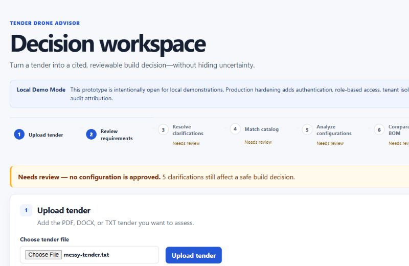
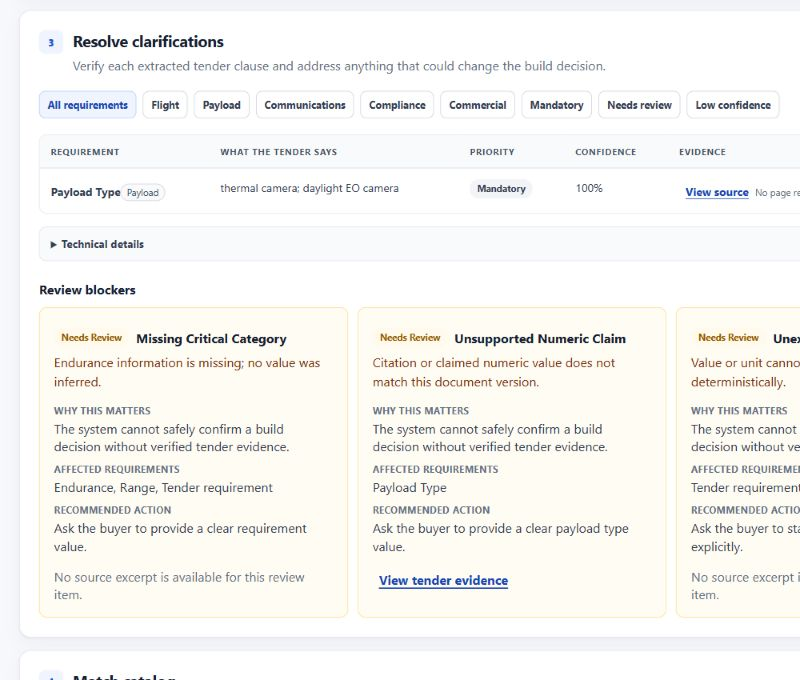
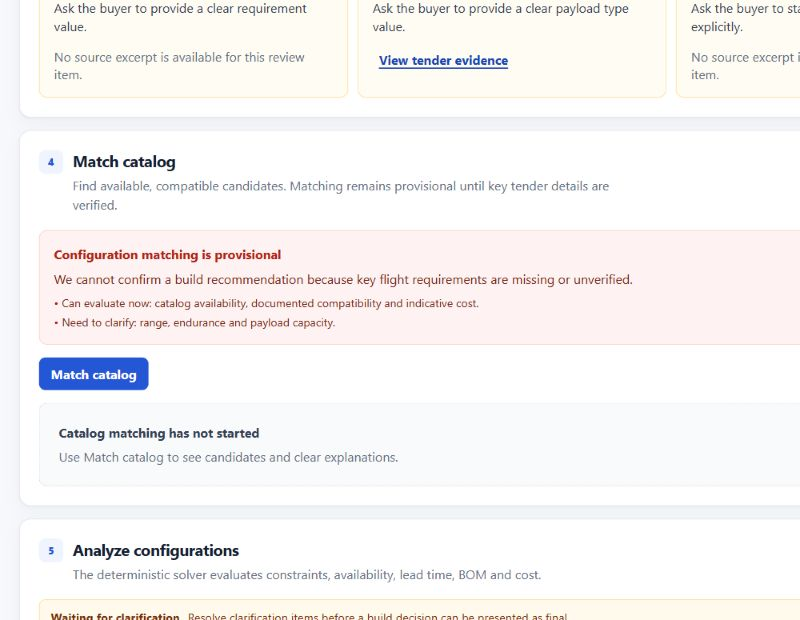

# C07 web application

## Visual verification snapshots

The following host-browser captures use only the version-controlled synthetic
`messy-tender.txt` fixture and the local fake provider. They are deliberately
stamped `Needs review` where tender data is incomplete; the product does not
present that state as an approved recommendation.







The Next.js workspace is a customer-facing, local/demo operations surface at `http://localhost:3000`. It calls only the typed FastAPI API at `NEXT_PUBLIC_API_BASE_URL` (default `http://localhost:8000`); it never calls a provider, storage service, solver, or catalog directly.

## Workflow and components

The responsive workspace follows a clear operations journey: Upload tender → Review requirements → Resolve clarifications → Match catalog → Analyze configurations → Compare cost and BOM → Read recommendation. It uses an original light, compact B2B visual system: restrained blue actions, neutral surfaces, 8px spacing, readable cards and responsive tables. The interface takes inspiration from the hierarchy and progressive disclosure of mature operations products, without copying their branding, layouts or assets.

The default extraction result is a concise human summary: whether the tender was processed, how many validated requirements are available, and why review is required. Raw workflow names, trace IDs, internal keys and source IDs stay in collapsed **Technical details** or **Technical audit trail** panels. The audit maps nodes to plain language such as “Read tender”, “Validate evidence” and “Check conflicts.” It never exposes prompts, raw tender text, keys or raw model responses.

Requirements have friendly titles, value/unit, priority, confidence, validation status and source page/section. Filters cover flight performance, payload, communications, compliance, commercial terms, mandatory values, low confidence and review items. Review blockers are deduplicated by type and affected category, explain why they matter, name a precise next action and offer a related-evidence action when a validated span exists.

Catalog matches are structured candidate cards rather than API dumps. A review-required extraction leads with a provisional warning and explains what is safe to inspect now and what needs clarification. Candidate details retain availability, weight, lead time, cost, up to three plain-language reasons and technical detail in a drawer. The analysis form reads the current catalog snapshot and displays its human-managed version label rather than asking an operations user to type an internal identifier. UUIDs are intentionally absent from the default decision interface.

Comparison exposes solver status, platform, mass, payload, material/total cost, lead time, stock, label and evidence availability. Detail keeps BOM lines, coverage evaluations and blockers. `feasible`, `conditionally_feasible`, `infeasible`, `needs_review`, queued/running/failed states are visually distinct. A review banner confirms no result is approved and engineering certification is still required. Human-friendly CSV and print exports contain the executive summary, blockers, configuration, BOM/cost facts and the evidence appendix. A needs-review result is explicitly stamped not approved.

## API, state and safety

`apps/web/lib/api.ts` owns typed C02 document APIs, C03 extraction/requirements/issues, C05 analyses/configurations, and C06 reports. It surfaces 404, 409, 422 and 503 as safe retry messages; creation supports 201/202 and idempotent 200. Controls disable while a mutation is outstanding. Polling is bounded exponential backoff (1–10 seconds) and clears on unmount/navigation.

Native labels, tables, status regions, keyboard buttons, focus rings and a labelled modal citation drawer support accessibility. Responsive tables scroll horizontally and controls reach 44px targets on small screens. Quotes are React text rather than HTML, so tender content is escaped. **Local Demo Mode** is deliberately open for a local demo; it does not pretend authentication exists. Production hardening must add authentication, RBAC, tenant isolation, signed uploads and per-user audit attribution. The browser contains no key and cost totals are never recalculated from paise.

## Local run and smoke

```powershell
docker compose up --build -d
cd apps/web
npm ci
npm run dev
```

Use the documented host-browser smoke at `http://localhost:3000`: upload a synthetic TXT fixture, wait for completed ingestion, start extraction, verify that no UUID is visible in the default view, check the grouped review blocker cards and provisional catalog warning, open a citation, expand the collapsed technical audit trail, then inspect a candidate drawer. C06's deterministic Compose smoke remains the API-backed integration gate. The backend currently has no cancellation/export endpoint, so the UI does not invent one.
