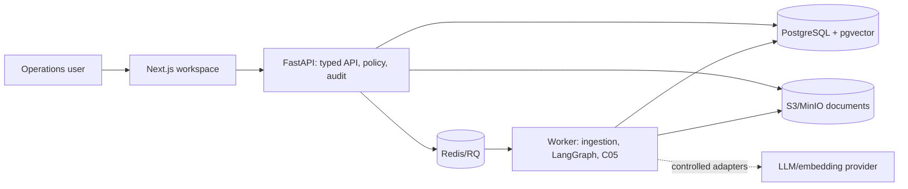
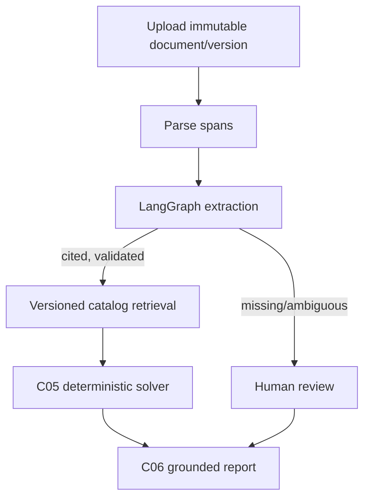

# Final architecture

## Modules and interfaces

`apps/web` renders only typed API facts. `apps/api/routes` owns upload/span APIs;
`extraction` owns cited requirement runs; `catalog` owns versioned capability
data; `analysis` calls the pure `solver`; and `rag` retrieves filtered evidence
and formats grounded reports. `security`, `audit`, `rate_limit`, `ops`,
`observability`, and `recovery` are C08 cross-cutting modules. API contracts are
Pydantic schemas and FastAPI OpenAPI; worker jobs carry IDs, never provider keys
or browser data.

LangChain supplies loader, prompt, structured model and embedding abstractions
inside nodes. LangGraph provides the state machine, bounded retry, conditional
review route, durable audit and resume. C05 is a pure deterministic authority for
engineering envelope, compatibility, availability, BOM and paise cost. RAG may
only organize retrieved facts; it cannot change solver output.

## Security, scaling and assumptions

Local Demo Mode is explicit and never permitted in a production environment.
Production adds a verified OIDC/JWT implementation, role authorization,
workspace-scoped document reads, ingress rate limits, TLS, managed storage,
secret injection and redacted audit/metrics. The current catalog is shared
synthetic demo data; tenant-managed catalogs require a follow-on scope migration.

Scale web/API by request load and workers by Redis queue latency. PostgreSQL and
object storage are stateful services with managed backup/restore. Inputs and
result identities make retries idempotent where the underlying job interfaces
support it, but delivery remains at-least-once—not exactly-once. No architecture
claim is a substitute for engineering approval, compliance certification or
production security assessment.
