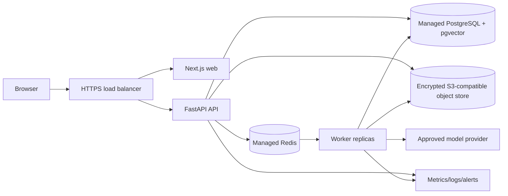

# Deployment runbook

## Target architecture

Start small: one web/API replica, one worker, managed PostgreSQL with daily
backups and point-in-time recovery, managed Redis, and private object storage.
Scale workers by queue latency; scale API independently by request latency.
pgvector indexes stay scoped by document/catalog snapshot and workspace. Do not
put provider keys in the browser, image, repository, or shell history.

## Production environment template

Copy `infra/production.env.example` into a secret manager, replace placeholders
there, and inject values at runtime. Never commit a populated file.

1. Build immutable tagged images and run dependency/vulnerability scanning.
2. Run `alembic upgrade head` as a single release job before API/worker rollout.
3. Deploy API and worker with `DEMO_MODE=false`, `AUTH_MODE=oidc`, validated OIDC
   issuer/audience, production CORS and secret-manager references.
4. Verify `/health`, authenticated `/v1/ops/readiness`, queue depth, and safe
   metrics. Then shift traffic.
5. Roll back application images first. Database rollbacks require a tested
   reverse migration or forward-compatible fix; never restore production data
   casually. Restore database/object storage through the managed backup process.

Retention: define tender/document retention and deletion policy with the customer.
Encrypt object storage and database at rest, require TLS in transit, use least-
privilege service identities, and retain redacted audit events according to the
contract. Rotate provider/storage/database credentials through the secret manager.

The Compose stack is intentionally for local demo use, not public internet
exposure. It has no TLS ingress or managed backup guarantee.
